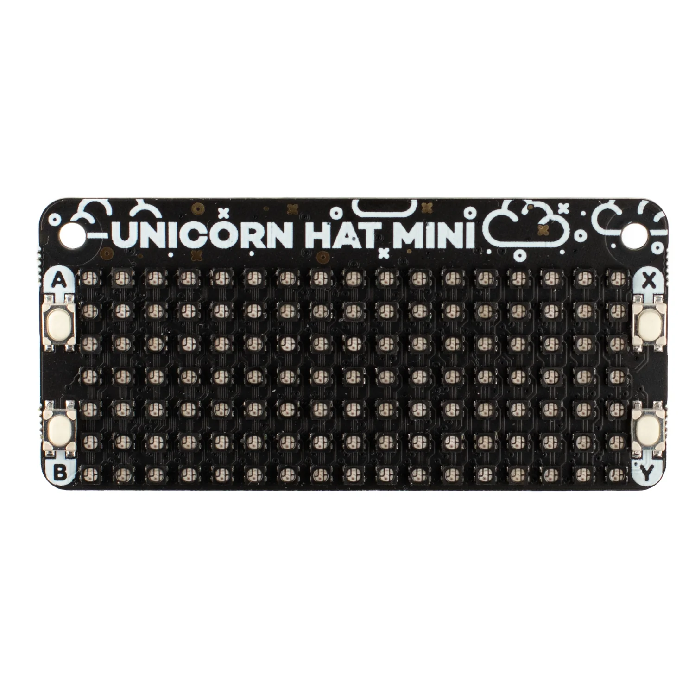

# Ostrostroj

## Installation
1. Build binary locally using CMake
1. Copy binary to the device (user's home directory): `scp .\build\src\ostrostroj ostrostroj:`
1. Copy startup script to the device: `scp .\scripts\ostrostroj.service ostrostroj:`
1. Connect to the device `ssh ostrostroj`
    1. Move binary: `sudo mv ~/ostrostroj /usr/local/bin/`
    1. Move startup script: `sudo mv ~/ostrostroj.service /etc/systemd/system/`
    1. Install: `sudo systemd install ostrostroj.service`
    1. Start: `sudo systemctl start ostrostroj`
    1. Enable auto start on boot: `sudo systemctl enable ostrostroj`
    1. Create workspace `sudo mkdir /srv/ostrostroj`
        1. Read, write for everyone: `sudo chmod -R 0775 /srv/ostrostroj`

## Running
- Option 1 manual run: `ostrostroj /srv/ostrostroj/`
- Option 2 run as a service :
    - `sudo service ostrostroj start`
    - `sudo service ostrostroj stop`

## Logs

- `journalctl -u ostrostroj`
- `service ostrostroj status`

## Development

- For faster deployment cycle:
    - `sudo chown rado:rado /usr/local/bin/ostrostroj`
    - `scp .\build\src\ostrostroj ostrostroj:/usr/local/bin/ostrostroj`

## Users Guide

This guide assumes that Elektron Syntakt is used as master MIDI device and Elektron Model:Cycles is used as a slave device (MIDI connections: Syntakt -> Ostrostroj -> M:C).

### Initial Setup

#### 1. Workspace Structure
Create following directory structure and copy (`scp`) audio files to it:
- Workspace root directory (`/srv/ostrostroj`)
    - Project directory (`01_domovy_poriadok`)
        - Song directory (`A01_kratke_dni`)
            - Section directory (`01_verse`)
                - Mono loop audio files (`L1.wav` - `L4.wav`)
                - Stereo loop audio files (`L5.wav`, `L6.wav`)
            - Another section directory (`02_chorus`)
                - Loop files...
                - *Hint: use symlinks to reuse existing loop files*
            - One shot files (`S1.wav`, `S2_.wav`, `S5_melody.wav`, ...)
        - Another song directory (`A05_menej`)

#### 2. Initialize New Project in Elektron Syntakt
1. Create new project
1. `Settings -> MIDI Config -> Sync`: enable Clock, Transport and Program Change send.

#### 3. Initialize MIDI Track 8 For a New Pattern
1. Switch to a (new) pattern (`A01` by default)
1. Switch to Track 8
    1. Machine: MIDI
    1. SYN PAGE (MIDI Source): Channel 8
    1. FLT PAGE (CC Value): enable all by setting them to 0 (zero) by pressing FUNC + encoder
    1. AMP PAGE (CC Select):
        1. Loops (unmute + saturation):
            1. CC1 Select=CC #111
            1. CC2 Select=CC #112
            1. CC3 Select=CC #113
            1. CC4 Select=CC #114
            1. CC5 Select=CC #115
            1. CC6 Select=CC #116
        1. One-shot:
            1. CC8 Select=CC #119

#### 4. Initialize Keyboard for Track 8
1. KB SCALE = CHRO
1. ROOT NOTE = C4
1. KB FOLD = ON

### Display

*TODO*

### Song Edit

*Important: Use `1ST` condition for each trig lock*

By default all loops are muted so to be able to hear anything you must unmute a loop.

1. Select `TRACK` 8 and switch to `GRID RECORDING` mode.
1. Each step represents a single block of looped playback of the current song section. The number of loops can be changed in `SONG MODE`. The first step defines which loops will play the first time this song section is played. The second step becomes active after the next pattern change to this song section again.
    
    Example: We have a song with two sections: `A01_verse` and `A05_chorus`. We create 2 steps for the first section `verse` and we start the playback. Now the first step is active and it stays active until we switch to `chorus`. Then if we switch back from `chorus` to `verse` that's when the second step of `verse` is activated.

#### Unmute and Saturation for Loops

Create parameter lock for the step and the CC which corresponds to the loop that you want to control. CC value `0` means that the loop is muted. Increasing the value increases both saturation level and also wet/dry mix (`127` is the max value). 

#### Unmute Model:Cycles Tracks

All Model:Cycles tracks are muted by default after a pattern change. To enable an M:C track add MIDI note to the step that you want the track to be enabled:
- C3 -T1 unmuted
- D3 -T2 unmuted
- E3 -T3 unmuted
- F3 -T4 unmuted
- G3 -T5 unmuted
- A3 -T6 unmuted

Only 4 tracks can be enabled because Syntakt can play only at most 4 notes at a time.

#### Automatic Playback of One-Shots

CC parameter #119 is used to trigger automatic playback of one-shot samples. CC value between `1` and `10` select one-shot file with the corresponding number.

#### Auxiliary Pattern for Single-Section Changes

The problem is when we want to make a change (un/mute a loop or play a one-shot) but we want to keep the same song section. Syntakt doesn't send any MIDI messages related to `SONG MODE`. We need to do the following trick.
    
Notice that there is a gap between patterns of `A01_verse` and `A05_chorus`. We can use it to create an auxiliary pattern `A02` but only on Syntakt, workspace structure remains unchanged. Now in `SONG MODE` we can add one row for `A01` and then right after it we can add another row for `A02`. During playback Syntakt switches from `A01` to `A02` but because we don't have a section for `A02`, Ostrostroj falls back to `A01`. This triggers a pattern change which activates the next step of `A01`.

Auxiliary pattern doesn't (and probably shouldn't) have anything on `TRACK` 8. It would overwrite the main pattern `A01`.

### Live Performance Controls

#### Loop Saturation Rotary Encoders

Switch to `TRACK` 8, `FLTR` page and use rotary encoders A - E to change saturation level for individual loops. To avoid sudden audio change encoder must be first turned "to catch" the current value and then it can be used to change it.

*Important: Avoid touching of the encoders during the first pass because it can mess up learning process.*

#### One-shot Samples Triggering

Turn on Keyboard and play individual notes to trigger one-shot samples. See display to know which keys are mapped to samples.

### System Controls

#### Device Shut Down

Gracefully shut down the device by playing notes in sequence C#5 + F#4 + D#5 (`TRIG` 6 + 15 + 8) hold 3 sec.

#### Device Restart

Gracefully restart the device by playing notes in sequence F4 + D5 + G4 (`TRIG` 14 + 7 + 16) hold 3 sec.

#### Service Restart

Use when you want to reload projects after workspace update by playing notes in sequence F4 + F#4 + G4 (`TRIG` 14 + 15 + 16) hold 3 sec.

#### Change Active Project

*TODO: Not implemented yet*